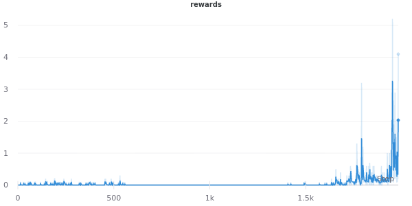
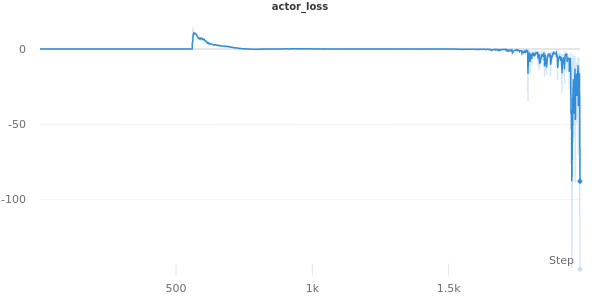
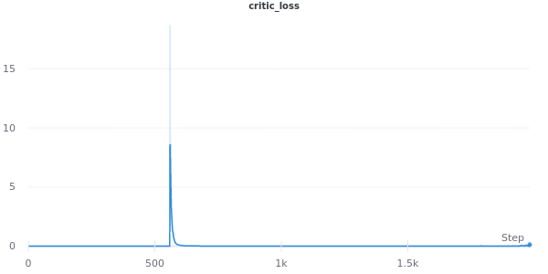

## DDPG for continuous control
This is a report on project 3 of the deep reinforcement learning nanodegree from udacity.
The Multi Agent Deep Deterministic Policy Gradient (MADDPG) algorithm is used for solving this rather complex collaborative continuous control task. See the [original paper](https://arxiv.org/pdf/1706.02275.pdf) by Lowe et al. for more information

#### 1. The Environment

- In this environment, two agents control rackets to bounce a ball over a net. If an agent hits the ball over the net, it receives a reward of +0.1. If an agent lets a ball hit the ground or hits the ball out of bounds, it receives a reward of -0.01. Thus, the goal of each agent is to keep the ball in play.
- The observation space consists of 8 variables corresponding to the position and velocity of the ball and racket. Each agent receives its own, local observation. Two continuous actions are available, corresponding to movement toward (or away from) the net, and jumping.
- The task is episodic, and in order to solve the environment, your agents must get an average score of +0.5 (over 100 consecutive episodes, after taking the maximum over both agents). Specifically,
- After each episode, we add up the rewards that each agent received (without discounting), to get a score for each agent. This yields 2 (potentially different) scores. We then take the maximum of these 2 scores. This yields a single score for each episode.
- The environment is considered solved, when the average (over 100 episodes) of those scores is at least +0.5.

#### 2. The Algorithm
- The MADDPG algorithm is used as it it specifically designed for a multi agent environment with a continuous action space and comes with great sample efficiency due to its off-policy nature
- It allows for the use of an experience buffer which greatly stabilizes training
- Despite the original DDPG paper advocating an Ornstein-Uhlenbeck process to add noise for exploration, we settle for a simple noise sampled from a normal distribution with mean=0 and std=1. 
- Algorithm specific Hyperparameters:
    - batch_size = 128
    - gamma = 0.99
    - buffer_size = 100.000
    - noise_factor = 0.5
    - noise_decay = 0.999
    - noise_minimum = 0.03
    - buffer_threshold = 0.1
    - train_every_n = 1
    - model_update_every_n = 2
    - tau = 0.01
    - lr_actor = 1e-4
    - lr_critic = 1e-3
- Exploration strategy:
  - We start with a random noise of 1.0 and decay it every step by a factor of 0.999 until it reaches the noise_minimum
  - We start training only after the buffer is at a minimum capacity of 100*buffer_threshold % to to avoid overfitting on early training examples


#### 3. Network Architecture
- A simple feed forward network is used for both actor and critic networks
- Both nets have 2 hidden layers, params are (n_inputs, 256, 256, n_outputs)
- Both nets use the Adam optimizer with default values for beta. The gradients are clipped with a value of 1.0. We use ReLu functions in all layers except the outputs.
- The actor output layer uses a tanh function to keep the values between -1 and 1. The critic output has no activation function to not constrain the differentiation between state values.

#### 4. Implementaion
- We make use of a simple wrapper to allow for a functionality coherent with the open ai gym package. Helps with readibility and is more familiar than ml-agants.

```python
class EnvWrapper:
    """A wrapper for the unity environment which implements functionalies similar to openai gym
    Params
    ======
        path(string): relative/absolute path to env executable
    """
    def __init__(self, path, no_graphics=True):
        self.env = UnityEnvironment(file_name=path, no_graphics=no_graphics)
        self.brain_name = self.env.brain_names[0]
        self.brain = self.env.brains[self.brain_name]
        self.env_info = None
        self.reset()

        self.action_space = self.brain.vector_action_space_size
        self.observation_space = self.env_info.vector_observations.shape[1]

    def step(self, actions):
        self.env_info = self.env.step(actions)[self.brain_name]
        next_state = self.env_info.vector_observations
        reward = self.env_info.rewards
        done = self.env_info.local_done
        return next_state, reward, done, None

    def reset(self):
        self.env_info = self.env.reset(train_mode=True)[self.brain_name]
        return self.env_info.vector_observations
```
- [utils.py](utils.py) also implements the experience buffer which is responsible for storing and sampling (s,a,r,d,s').
- [models.py](models.py) implements the simple feed forward models.
- [agent.py](agent.py) implements the MADDPG class that handles the interaction with the env and the learning functionality
- For an implementation of the training loop, please view [maddpg_train.py](maddpg_train.py). 

#### 4. Results

- The provided graphics below show the results for the rewards and losses
- using the provided hyperparameters we achieve a very stable training process and solve the env after 256 episodes (although this technically means 256 * 20 agents)






#### 6. Future improvements
The following improvements come to mind that might be able to tweak the algorithm further and reduce training time / increase convergence
- Exploration strategy:
  - Since exploration strategies are not an exact science there is a great deal of possibilities that can be tried to enhance exploration in early stages. The simplest approach would be to run a hyperparameter optimization over the current configuration albeit compute intensive. Another approach might be to remove the buffer threshold and try different values for noise_factor and noise_decay. Even fixed noise_factors might be possible.
  - Introducing a dynamic experience_buffer size could be an interesting idea.
- Model complexity:
  - Trying different architectures, adding batch / layer normalization
  - Using a single network (sharing parameters in early layers) with 2 output heads
- Env:
  - Changing the reward structure of the underlying env, eg. introducing neg. points 
